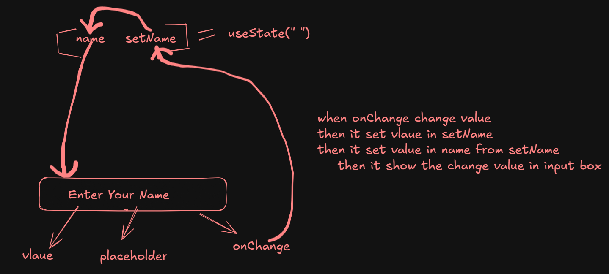

# hooks:
Hooks are special function that let you use state and other react features inside functional components.Before hooks these features only available in class components.
<br>
In Simple words we can say that Hooks allow functions to have access to state and other React features without using classes.
<br>

<b>Why hooks are used :</b>

```bash
1. Use state in functional components.

2. Avoid class components (simpler code).

3. Reuse logic easily.

4. Better code readability & maintainability.

5. Handle lifecycle methods (mount, update, unmount).

```

<b>Rules of hooks :</b>

```bash
1. call hooks only at top level.

2. call mhooks only react functions.

3. Don't use hooks inside loops and conditions.

```
<b>Here are some hooks that are mostly used in react</b>


# State in React :
State is a built-in object which is used to store data that can change over time and control the UI.
<br>
In Simple terms State is like a switch that controls UI behavior. When it changes, the UI updates automatically.
<br>
When state changes -> React re-renders the component.
<br>

<b>Simple Real World Example:</b>

```bash
  Think of a room light

   ON -> Light is visible
   OFF -> Light is hidden

  This changing value = state

```

<b>React Example :</b>

```bash

import { useState } from "react";

function Light() {
  const [isOn, setIsOn] = useState(false);

  return (
    <>
      <h1>{isOn ? "Light ON" : "Light OFF"}</h1>

      <button onClick={() => setIsOn(!isOn)}>
        Toggle Light
      </button>
    </>
  );
}


Explanation:

isOn -> state (stores ON/OFF)

setIsOn -> updates state

Button click -> changes state

UI updates automatically

```
# useState :

<b> 1. Basic Syntax:</b>

```bash
import { useState } from "react";

const [state, setState] = useState(initialValue);

Here,

state -> It is like a variable that store current value.

setState -> It is used to set or update value. Means we can set a new value.

```

<b>2. Example </b>

```bash
import { useState } from "react";

function Counter() {
  const [count, setCount] = useState(0);

  return (
    <>
      <h1>{count}</h1>
      <button onClick={() => setCount(count + 1)}>+</button>
    </>
  );
}
```
When button clicks -> state updates -> UI updates.
<br>

<b>3. Types of State :</b>

```bash

1. Number state:

const [count, setCount] = useState(0);

2. String State:

const [name, setName] = useState("");

3. Boolean State:

const [isOpen, setIsOpen] = useState(false);

4. Array State:

const [items, setItems] = useState([]);

5. Object State:

const [user, setUser] = useState({ name: "", age: 0 });

```
<b>4. Updating State :</b>

```bash

1. Simple Update:

setCount(count + 1);

2. Functional Update (Best Practice)

setCount(prev => prev + 1);

```
<b>5. Updating Object State</b>

```bash

setUser(prev => ({
  ...prev,
  name: "Nitish"
}));

```

<b>6. Updating Array State</b>

```bash

setItems(prev => [...prev, "New Item"]);

```

<b>7. State with Forms</b>

```bash

const [name, setName] = useState("");

<input 
  value={name} 
  onChange={(e) => setName(e.target.value)} 
/>

```
# Form Handling :
Form handling in React means managing user input using state, handling submission, and validating data.
<br>
Mostly form handling is done by following this:

```bash

1. useState -> This is used to store input vlaue of form.In simple words we can say that useState is used to store and manage form data. 
This is used in form To save user input , To make input controlled by React . 

2. onChange -> onChange is an event that runs when input value changes.

3. onSubmit -> onSubmit is an event that runs when form is submitted.

```
<b>Example :</b>

```bash
import { useState } from "react";

function Form() {
  const [formData, setFormData] = useState({
    name: "",
    email: ""
  });

  const handleChange = (e) => {
    setFormData({
      ...formData,
      [e.target.name]: e.target.value
    });
  };

  const handleSubmit = (e) => {
    e.preventDefault();
    console.log(formData);
  };

  return (
    <form onSubmit={handleSubmit}>
      <input 
        name="name"
        placeholder="Name"
        onChange={handleChange}
      />

      <input 
        name="email"
        placeholder="Email"
        onChange={handleChange}
      />

      <button type="submit">Submit</button>
    </form>
  );
}

```
# Two Way Data Binding :
Two-way data binding means data flows between UI and state in both directions.
<br>
In React, it is achieved using:
<br>
useState
<br>
onChange


<b>Example :</b>

```bash
import { useState } from "react";

function App() {
  const [name, setName] = useState("");

  return (
    <>
      <input 
        value={name} 
        onChange={(e) => setName(e.target.value)} 
      />

      <h1>{name}</h1>
    </>
  );
}

```

# Local Storage:
Local Storage is a type of Web Storage that is used to store data in the user's browser.
Local Storage stores the data permanently (until manually cleared) even after page reload , browser close.Data Store in Local Storage as key value pair. <b>Always remember data store in local storage as String.</b>
<br>

<b>Use Case :</b>

```bash
1. Save user login info

2. Theme (dark/light mode)

3. Cart items

```

<b>Methods of Local Storage :</b>

```bash
1. localStorage.setItem("key", "value")   => This method is used to set data in local storage.

Example:
localStorage.setItem("name", "Nitish");

2. localStorage.getItem("key");   => This method is used to get data from local storage.

Example:
localStorage.getItem("name");   

3. localStorage.removeItem("key"); => This method is used to remove or delete data from local storage.

Exammple:
localStorage.removeItem("name");

4. localStorage.clear();  => This method is used to clear all data from local storage.

Example:
localStorage.clear();

```
<b>If You want to store object in localStorage</b>
<br>
Objects and arrays are stored using JSON.stringify() and retrieved using JSON.parse() because localStorage only supports strings.

```bash
const user = {
  name: "Rohan",
  age: 21
};

// Store
localStorage.setItem("user", JSON.stringify(user));

// Get
const storedUser = JSON.parse(localStorage.getItem("user"));

console.log(storedUser.name); // Rohan

```

<b>If You want to store Array in localStorage</b>

```bash
const user = {
  name: "Nitish",
  age: 21
};

// Store
localStorage.setItem("user", JSON.stringify(user));

// Get
const storedUser = JSON.parse(localStorage.getItem("user"));

console.log(storedUser.name); // Nitish

```

# API calls in React :
API (Application Programming Interface) is a way to get or send data between frontend (React) and backend/server.
<br>
For Example :
<br>
1. Fetch users.
<br>
2. Send ligin Data.
<br>
3. Get Products.
<br>

<b>Why API Calls are Used?</b>

```bash
1. To get dynamic data

2. To connect frontend with backend

3. To store/fetch data from database

```

<b>How to Make API Calls in React?</b>
There are mainly two ways or method that is used to make API Calls in React.

```bash
1. fetch() -> This is an built in function or method 

2. axios -> This is a third party library that is used to call an API in  react.

```

<b>1. Using fetch() (Basic)</b>

```bash
import { useState, useEffect } from "react";

function App() {
  const [data, setData] = useState([]);

  useEffect(() => {
    fetch("https://jsonplaceholder.typicode.com/users")
      .then(res => res.json())
      .then(data => setData(data));
  }, []);

  return (
    <>
      {data.map(user => (
        <p key={user.id}>{user.name}</p>
      ))}
    </>
  );
}

```
<br>
Flow of this code:
<br>
1. Component loads
<br>
2. useEffect runs
<br>
3. API call happens
<br>
4. Data stored in state
<br>
5. UI updates

<b>Using async/await (Best Practice)</b>

```bash
useEffect(() => {
  const fetchData = async () => {
    const res = await fetch("https://jsonplaceholder.typicode.com/users");
    const data = await res.json();
    setData(data);
  };

  fetchData();
}, []);

```

<b>2. Using Axios</b>

<b>Install axios library</b>

```bash
npm install axios
```
<br>

<b>Example:</b>

```bash
import axios from "axios";

useEffect(() => {
  axios.get("https://jsonplaceholder.typicode.com/users")
    .then(res => setData(res.data));
}, []);

```


